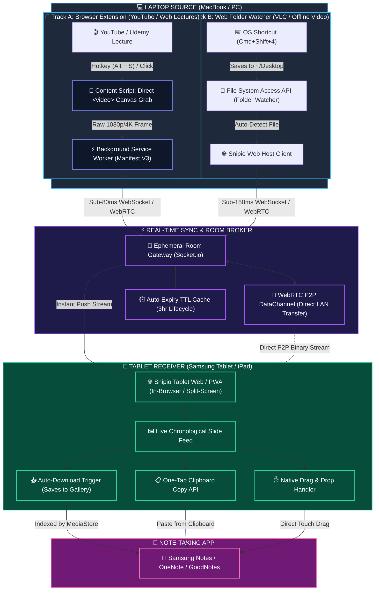
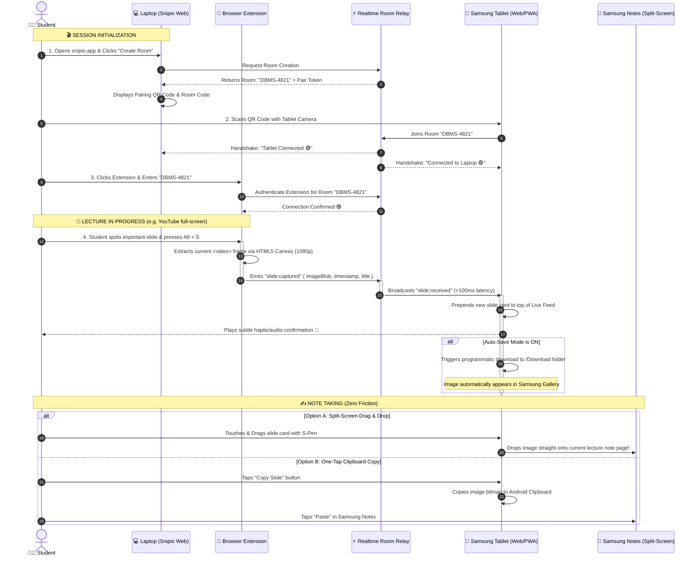

# 🏗️ Snipio System Architecture & Deep Technical Specification

This document provides a comprehensive technical blueprint of the **Snipio** ecosystem, detailing the **Laptop Capture Engine (Browser Extension & Folder Watcher)**, the **Real-Time Transfer Layer**, and the **Tablet Receiver Mechanics (Web App vs Native App, Auto-Download & Split-Screen integration)**.

---

## 📱 1. Tablet Architecture: Does it need a dedicated App or Web App?

### 🎯 The Core Verdict
**NO native App Store download is required.** A **Progressive Web App (PWA) / Responsive Web App** running in Chrome or Samsung Internet on the tablet provides the entire zero-friction experience.

---

### 📥 How Automatic Download / Auto-Save Works on the Tablet

When the tablet joins the room via QR code (`snipio.app/room/DBMS-4821`), it opens the **Tablet Receiver UI**. Here is how screenshots arrive and get saved automatically:

```
┌──────────────────────────────────────────────────────────────────────────────────────────┐
│                                 TABLET RECEIVER MODES                                    │
│                                                                                          │
│  MODE 1: SPLIT-SCREEN DRAG & DROP (Recommended for Samsung Notes / OneNote)              │
│  • Tablet runs Snipio and Samsung Notes side-by-side in split view.                     │
│  • Screenshot arrives instantly (<150ms).                                                │
│  • Student drags the card with finger / S-Pen directly into Samsung Notes!              │
│                                                                                          │
│  MODE 2: ONE-TAP CLIPBOARD COPY                                                          │
│  • Student taps the received slide card.                                                 │
│  • Raw image bitmap is copied directly to device clipboard via Clipboard API.            │
│  • Tap "Paste" in Samsung Notes.                                                         │
│                                                                                          │
│  MODE 3: AUTO-DOWNLOAD TO GALLERY / STORAGE                                              │
│  • "Auto-Save" toggle enabled in room header.                                            │
│  • As soon as a screenshot arrives, a programmatic download is triggered automatically.  │
│  • Images immediately appear in Samsung Gallery & Files under "Downloads/Snipio".        │
└──────────────────────────────────────────────────────────────────────────────────────────┘
```

#### ⚙️ Technical Auto-Download Implementation in Browser:
```typescript
// Executed on the Tablet Web App whenever a new screenshot event arrives
export function autoSaveImage(blob: Blob, slideIndex: number, lectureName: string) {
  const url = URL.createObjectURL(blob);
  const anchor = document.createElement('a');
  anchor.href = url;
  anchor.download = `${lectureName}_Slide_${String(slideIndex).padStart(2, '0')}.png`;
  
  // Programmatically trigger download
  document.body.appendChild(anchor);
  anchor.click();
  document.body.removeChild(anchor);
  
  // Clean up memory
  setTimeout(() => URL.revokeObjectURL(url), 2000);
}
```
* **Android Behavior**: On Android (Samsung Internet, Chrome, Brave), files downloaded this way immediately land in the internal `/Download` directory and are automatically indexed by the **Android MediaStore**, instantly making them visible inside the **Samsung Gallery** and available to insert into Samsung Notes.

---

### 📊 Comparison: Web App (PWA) vs Native Android App

| Feature | Tablet Web App / PWA | Native Android Companion App (APK) |
| :--- | :---: | :---: |
| **Installation Friction** | 🌟 **Zero Install** (Scan QR & Ready) | Requires downloading APK / Play Store |
| **Split-Screen Drag to Notes** | ✅ **Full Support** (HTML5 Drag & Drop) | ✅ Full Support |
| **One-Tap Clipboard Copy** | ✅ **Full Support** (`navigator.clipboard`) | ✅ Full Support |
| **Auto-Save to Gallery** | ✅ **Yes** (Via Auto-Download stream) | ✅ Direct background MediaStore insert |
| **Silent Background Sync** | Works while tab is active / PWA open | Works even when screen is locked |
| **Best Used For** | 🏆 **99% of students & lectures** | Advanced power users needing background sync |

---

## 🧐 2. Laptop Capture: Browser Extension Analysis

### Is the Browser Extension Idea Reliable?
**YES — It is the cleanest, fastest, and highest-quality solution for web lectures (YouTube, Coursera, Udemy, LMS).**

```
┌────────────────────────────────────────────────────────────────────────────────────────┐
│                                 BROWSER SANDBOX BOUNDARY                               │
│                                                                                        │
│   ✅ INSIDE BROWSER (YouTube, Udemy, Web Lectures)                                     │
│   • Direct <video> frame extraction via Canvas (Native 1080p/4K without UI clutter)    │
│   • Full tab screenshot via chrome.tabs.captureVisibleTab                              │
│   • Extension Hotkey listener (e.g., Alt + S or Cmd + Shift + S)                       │
│   • Background WebSocket / WebRTC connection to Room                                   │
│   • Floating "Quick Snip" button on video players                                      │
│                                                                                        │
├────────────────────────────────────────────────────────────────────────────────────────┤
│                                                                                        │
│   ⚠️ OUTSIDE BROWSER (VLC Player, Zoom App, OS Desktop)                                │
│   • Extensions CANNOT listen to global OS hotkeys (Cmd+Shift+4) when Chrome is blurred │
│   • Solution: Fallback to Web App's File System Access API (Folder Watcher)            │
└────────────────────────────────────────────────────────────────────────────────────────┘
```

#### 🌟 Why the Extension is Superior for Video Lectures:
1. **Raw Video Frame Extraction**: Injects a content script that reads the `<video>` element directly into an HTML5 `<canvas>`, capturing the **pure slide image at full 1080p/4K** without video controls, volume sliders, or browser tabs.
2. **Dedicated Hotkey (`Alt + S`)**: Using `chrome.commands`, pressing `Alt + S` captures and transfers the frame in **under 80ms** without pausing the lecture.

---

## 🏛️ 3. High-Level System Architecture



---

## 🔄 4. Complete End-to-End Sequence Diagram



---

## 🛠️ 5. Technical Implementation Details

### Component Breakdown

```
snipio/
├── src/                          # Main Web Application (Next.js 15/16)
│   ├── app/
│   │   ├── page.tsx              # Landing & Room Creation
│   │   └── room/[roomId]/
│   │       ├── page.tsx          # Dynamic View (Host vs Tablet Receiver)
│   │       └── layout.tsx
│   ├── components/
│   │   ├── layout/               # Navbar, Footer, Reveal, icons
│   │   ├── landing/              # Home page sections & room card
│   │   └── room/                 # Host dashboard + tablet feed
│   │       ├── HostDashboard.tsx
│   │       ├── TabletFeed.tsx
│   │       ├── SlideCard.tsx
│   │       └── AutoSaveToggle.tsx
│   └── lib/
│       ├── realtime.ts           # Socket.io client & WebRTC DataChannels
│       └── autoSave.ts           # Programmatic download & clipboard handler
│
├── extension/                    # Chrome / Edge Manifest V3 Extension
│   ├── manifest.json
│   ├── popup.html & popup.ts     # Room Code entry & status indicator
│   ├── content.ts                # Video canvas extractor & Alt+S listener
│   └── background.ts             # Persistent WebSocket connection to Room
│
└── server/                       # Lightweight Realtime Signaling Gateway
    └── socketServer.ts           # Ephemeral room manager & event broadcaster
```

---

## 🚀 6. Summary: Why This Architecture Wins
1. **Zero Device Installs on Tablet**: No Play Store installation needed; works in any browser or saved PWA.
2. **True Sub-100ms Latency**: WebSocket / WebRTC streams data in real-time.
3. **No Clutter on Slide**: Extension grabs pristine video frames straight from the `<video>` element.
4. **Native Split-Screen Ready**: Built specifically for students using Samsung Notes / OneNote side-by-side.
