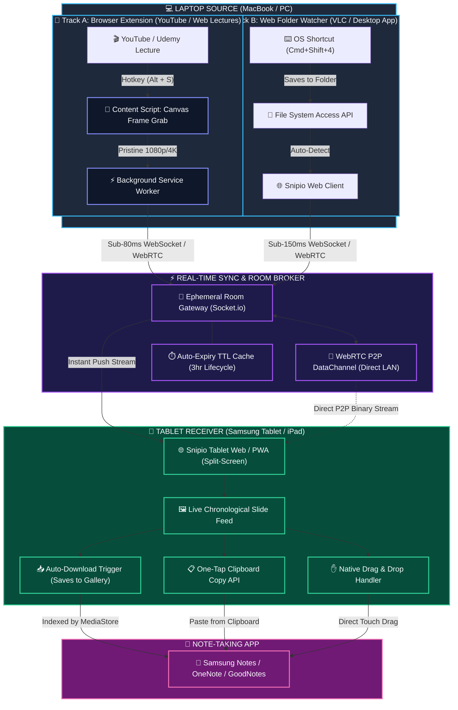
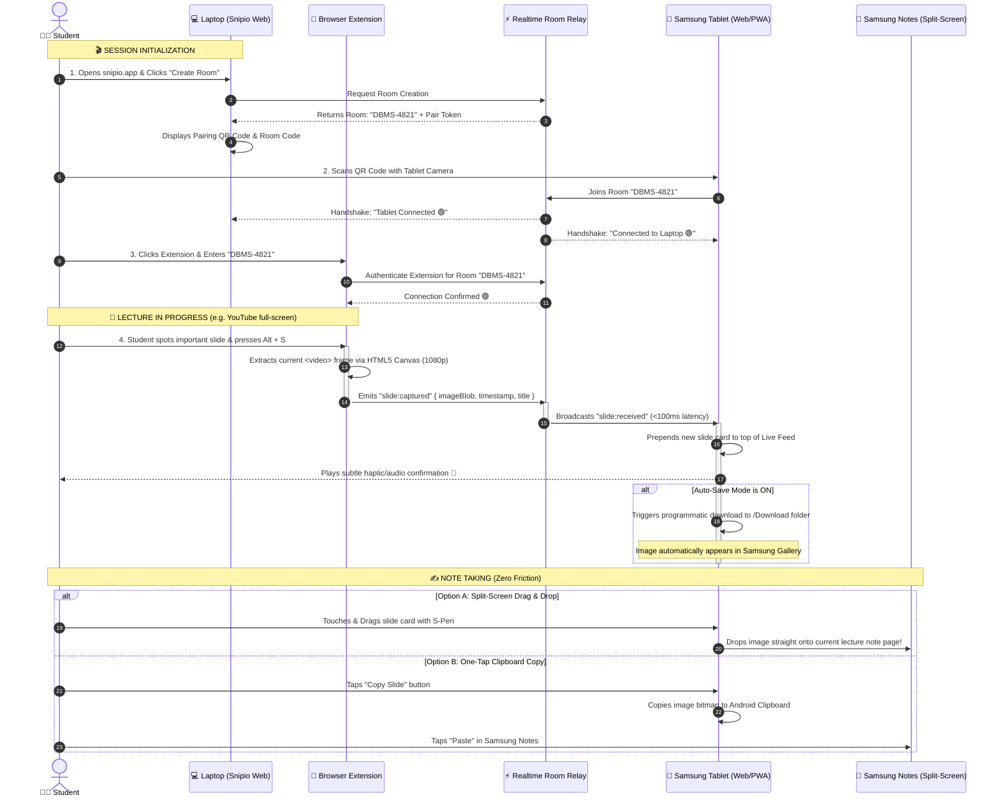

# ⚡ Snipio (SnipGo)

> **"Take a screenshot on your laptop — and it's instantly on your tablet."**  
> *Zero friction. Zero WhatsApp. Zero manual uploads.*

---

## 🎯 The Problem

When studying or watching video lectures (YouTube, Coursera, Udemy, college portals) on a laptop:
1. You take a screenshot of an important slide, code snippet, or diagram.
2. You want that screenshot immediately in your note-taking app on your tablet (Samsung Notes, GoodNotes, OneNote, Notability).
3. **The Current Painful Workflow**:
   ```
   Take Screenshot ➜ Open WhatsApp Web ➜ Send to "Me" ➜ Pick up Tablet ➜ Open WhatsApp ➜ Download Image ➜ Import to Notes
   ```
   *5 to 7 manual steps for every single slide during a 2-hour lecture.*

---

## 💡 The Snipio Solution

Snipio turns that multi-step friction into a seamless, automatic background flow:

```
[ Laptop: Take Screenshot / Alt+S ]  ───( Sub-100ms Sync )───►  [ Tablet: Instantly in Feed / Drag into Notes ]
```

- 🚀 **Zero Friction**: Captures pristine 1080p/4K video frames directly from YouTube via the browser extension (`Alt + S`) or OS screenshot shortcut (`Cmd + Shift + 4`).
- ⚡ **Instant Transfer**: Real-time WebRTC P2P / WebSocket transfer in under 100ms.
- 📱 **Zero Install on Tablet**: Works directly in **Chrome or Samsung Internet** on your tablet (or installed as a 1-tap PWA).
- ✍️ **Samsung Notes Ready**: Optimized for split-screen with **direct drag-and-drop**, **one-tap clipboard copy**, and **auto-save to gallery**.
- 🔒 **Ephemeral & Private**: Temporary rooms with QR code joining — no sign-up or accounts required.

---

## 📱 How Does the Tablet Receive & Auto-Download Screenshots?

### ❓ Is a native tablet app required?
**No! A zero-install Web App / PWA (Progressive Web App) is all you need.**
You simply scan the QR code displayed on your laptop using your tablet camera. It immediately opens the Snipio room (`snipio.app/room/DBMS-4821`) in Chrome or Samsung Internet.

### 📥 3 Tablet Receiving Modes:

1. **🖐️ Split-Screen Drag & Drop (Recommended)**:
   - Run Snipio on one half of your tablet screen and **Samsung Notes** on the other half.
   - When a slide arrives, touch and drag the card with your finger or S-Pen straight into your notes!
2. **📋 One-Tap Clipboard Copy**:
   - Tap the slide card. The raw image bitmap is copied directly to the Android clipboard.
   - Tap "Paste" in Samsung Notes.
3. **📥 Auto-Download to Gallery**:
   - Enable the "Auto-Save" toggle on the tablet page.
   - As soon as a screenshot arrives, the web app triggers an automated background download (`<a download>`), saving the file into `/Download` where it is instantly indexed into the **Samsung Gallery**.

---

## 🏗️ High-Level System Architecture



---

## 🔄 Complete End-to-End Sequence Diagram



---

## 🛠️ Tech Stack

| Layer | Technology | Purpose |
| :--- | :--- | :--- |
| **Frontend Framework** | [Next.js](https://nextjs.org/) (App Router, React 19, TypeScript) | High-performance, responsive web application |
| **Styling & UI** | [Tailwind CSS v4](https://tailwindcss.com/) + [Lucide Icons](https://lucide.dev/) + [Framer Motion](https://www.framer.com/motion/) | Slick, dark-mode first, animated UI designed for dual-screen productivity |
| **Browser Extension** | Chrome / Edge Manifest V3 (`popup`, `content_scripts`, `background`) | One-hotkey (`Alt + S`) pristine video canvas capture |
| **Realtime Sync** | WebSockets (Socket.io) + WebRTC DataChannels (PeerJS) | Sub-100ms P2P direct transfers across local Wi-Fi with cloud fallback |
| **Auto-Capture Engine** | Video Canvas Extractor + Web File System Access API | Zero-interaction screenshot detection on web video & Desktop folder |
| **Tablet Experience** | HTML5 Drag & Drop, Async Clipboard API, Auto-Save | Seamless integration with Samsung Notes & Gallery |
| **Export Engine** | `jspdf` / `jszip` | One-click export of the lecture's captured slides into a study PDF / ZIP |

---

## 🚀 Getting Started

### Prerequisites
- Node.js 18.x or 20.x+
- npm / pnpm / yarn

### Installation & Local Run

```bash
# 1. Clone the repository
git clone https://github.com/akt9802/SnipGo.git
cd Snipio

# 2. Install dependencies
npm install

# 3. Start development server
npm run dev
```

Open [http://localhost:3000](http://localhost:3000) on your laptop, create a room, and scan the QR code with your tablet!

---

## 📄 Documentation

- 📘 [Problem Statement](file:///Users/amankumar/Personal-Work/Coding/Snipio/Docs/ProblemStatement.md)
- 📗 [Solution Overview](file:///Users/amankumar/Personal-Work/Coding/Snipio/Docs/Solution.md)
- 📙 [Deep System Architecture & Extension Analysis](file:///Users/amankumar/Personal-Work/Coding/Snipio/Docs/System-Architecture.md)

---

## 📄 License

MIT License. Free to use for students, learners, and creators worldwide.
